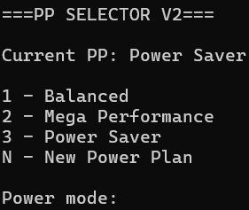

Tired of going all the way into Control Panel to change your Power Plan? This simple (and awesome) tool has got you covered! 

**PP Selector V2** was originally a personal project which has been revamped to be more user-friendly.

---

## Features

- Displays Active Power Plan
- Automatic Power Plan Detection
- Change Power Plan in a Click & Tap!

---

## Usage

Run the script and select your Power Plan of choice!

---

## Roadmap

- Custom Power Plan Sorting
- Shortcut to Create New Power Plan
- Mega Awesome System Tray Icon